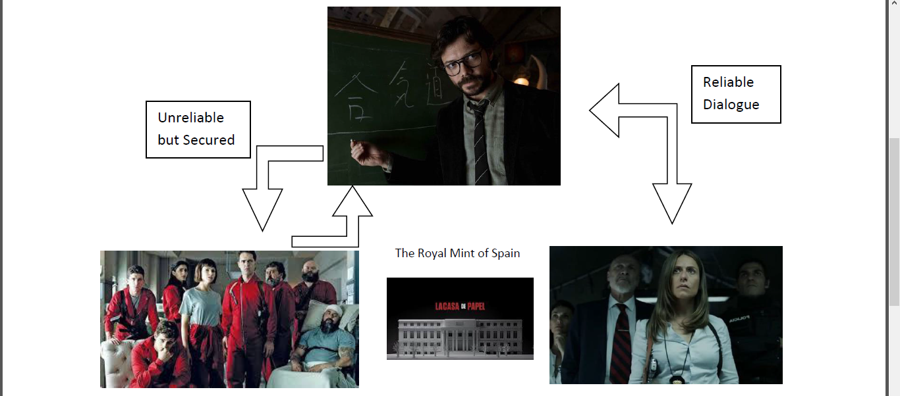
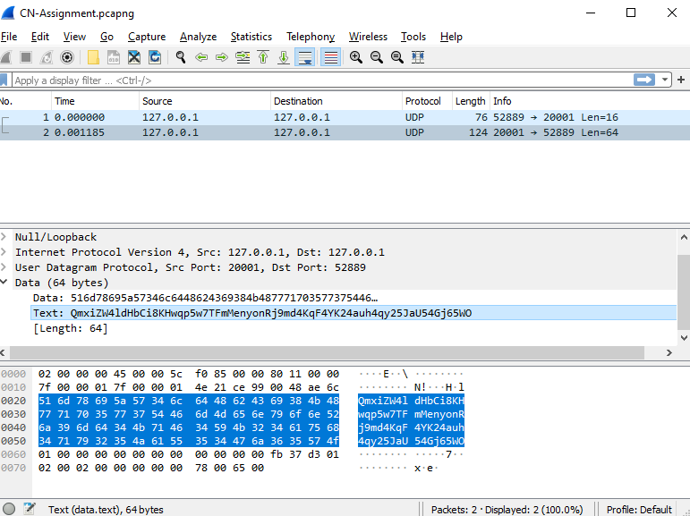

Network & Security Assignment

# La Casa de Papel

“The Professor” is planning a heist at Royal Mint of Spain. He recruits a group of eight people (Berlin, Tokyo, Nairobi, Rio, Moscow, Denver, Helsinki, and Oslo) to carry out the heist. The plan is to capture the Mint for 11 days, so his team can print the money as they deal with elite police force. The Professor will head the heist from an external location. To prevent the elite police force to break in the Mint and give his team time to continue the heist, Professor will negotiate with the police headed by inspector Raquel Murillo. Now, Professor is in need to establish two kinds of separate networks: A reliable persistent network for negotiating dialogues with inspector Raquel Murillo and an unreliable but secured network to communicate with his team at the Royal Mint.

The Professor recruits a brilliant engineer from India (You – A Double Agent) to help him setup his communication requirement. Design the working prototype for Professor to fulfil his needs for the heist.
Later, you are asked by elite police force to help them by capturing the secured communications between The Professor and his Dali team. You capture the secured communication packets and provide as much of the details about captured secured communication to police.

## I, am being your communicator, need the following:

1. The working prototype for “Professor” communication requirements.
2. The secured communication packet captures with their meanings/details (as much you can) for Raquel/Elite Police Force.

## Solution

The custom encryption used is a fibonacci substitution cipher (each letter incremented [utf-8] by fibonnacci term corresponding to the index of the letter) followed by base64 encoding. The Text data from the captured packets, as shown below,

is pasted into the capturedText.txt file included and on exectuting decode.py, the decoded message is printed. 